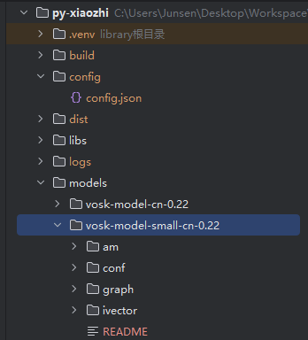

# py-xiaozhi Usage Guide (Please Read Carefully)


## Usage Introduction

- There are two voice modes: push-to-talk and auto conversation. The button in the lower-right corner shows the current mode.
- Push-to-talk: hold to speak, release to send
- Auto conversation: click to start a conversation. When the interface shows "Listening", it is your turn to speak; your speech will be sent automatically after you finish.
- GUI mode:
  - F2 key: push-to-talk
  - F3 key: interrupt conversation
- CLI mode:
  - F2 key: press once to start auto conversation
  - F3 key: interrupt conversation

## Configuration Guide

### Project Basic Configuration

#### Configuration File Overview

The project uses two configuration methods: initial configuration template and runtime configuration file.

1. **Initial Configuration Template**
   - Location: `/src/utils/config_manager.py`
   - Purpose: Provides default configuration template; automatically generates the config file on first run
   - Usage: Modify this file when running for the first time or when resetting configuration

2. **Runtime Configuration File**
   - Location: `/config/config.json`
   - Purpose: Stores actual runtime configuration information
   - Usage: Modify this file during daily use

#### Configuration Item Descriptions

- Add whatever configuration you need and retrieve it via config_manager. Reference websocket or iot\things\temperature_sensor.py
- For example, to get "endpoint" from "MQTT_INFO", use `config.get_config("MQTT_INFO.endpoint")` to retrieve **endpoint**

```json
{
  "CLIENT_ID": "Auto-generated client ID",
  "DEVICE_ID": "Device MAC address",
  "NETWORK": {
    "OTA_VERSION_URL": "OTA update URL",
    "WEBSOCKET_URL": "WebSocket server address",
    "WEBSOCKET_ACCESS_TOKEN": "Access token"
  },
  "MQTT_INFO": {
    "endpoint": "MQTT server address",
    "client_id": "MQTT client ID",
    "username": "MQTT username",
    "password": "MQTT password",
    "publish_topic": "Publish topic",
    "subscribe_topic": "Subscribe topic"
  },
  "USE_WAKE_WORD": false,          // Enable voice wake-up
  "WAKE_WORDS": [                  // Wake word list
    "小智",
    "你好小明"
  ],
  "WAKE_WORD_MODEL_PATH": "./models/vosk-model-small-cn-0.22",  // Wake word model path
  "TEMPERATURE_SENSOR_MQTT_INFO": {
    "endpoint": "Your MQTT address",
    "port": 1883,
    "username": "admin",
    "password": "dtwin@123",
    "publish_topic": "sensors/temperature/command",
    "subscribe_topic": "sensors/temperature/device_001/state"
  },
  "CAMERA": { // Vision configuration
    "camera_index": 0,
    "frame_width": 640,
    "frame_height": 480,
    "fps": 30,
    "Local_VL_url": "https://open.bigmodel.cn/api/paas/v4/", // Zhipu application address: https://open.bigmodel.cn/
    "VLapi_key": "Your key"
  }
  // ...Add any configuration you need
}
```

#### Configuration Modification Guide

1. **First-time configuration**
   - Simply run the program; the system will automatically generate a default configuration file
   - To modify default values, edit `DEFAULT_CONFIG` in `config_manager.py`

2. **Changing server configuration**
   - Open `/config/config.json`
   - Modify `NETWORK.WEBSOCKET_URL` to the new server address
   - Example:

     ```json
     "NETWORK": {
       "WEBSOCKET_URL": "ws://your-server-address:port/"
     }
     ```

3. **Enabling voice wake-up**
   - Set `USE_WAKE_WORD` to `true`
   - Add or modify wake words in the `WAKE_WORDS` array

#### Important Notes

- Restart the program for configuration changes to take effect
- The WebSocket URL must start with `ws://` or `wss://`
- A CLIENT_ID is automatically generated on first run; it is recommended not to modify it manually
- DEVICE_ID defaults to the device MAC address and can be modified as needed
- The config file uses UTF-8 encoding; please use a UTF-8-compatible editor

## Startup Guide

### System Dependency Installation

#### Windows

1. **Install FFmpeg**

   ```bash
   # Method 1: Install via Scoop (recommended)
   scoop install ffmpeg

   # Method 2: Manual installation
   # 1. Visit https://github.com/BtbN/FFmpeg-Builds/releases to download
   # 2. Extract and add the bin directory to system PATH
   ```

2. **Opus Audio Codec Library**
   - The project automatically includes opus.dll by default; no manual installation is needed
   - If you encounter issues, copy `/libs/windows/opus.dll` to one of the following locations:
     - Application directory
     - `C:\Windows\System32`

#### Linux (Debian/Ubuntu)

```bash
# Install system dependencies
sudo apt-get update
sudo apt-get install python3-pyaudio portaudio19-dev ffmpeg libopus0 libopus-dev

# Install volume control dependencies (choose one of the three)
# 1. PulseAudio utilities (recommended)
sudo apt-get install pulseaudio-utils

# 2. Or ALSA utilities
sudo apt-get install alsa-utils

# 3. If using the alsamixer method, also install expect
sudo apt-get install alsa-utils expect


sudo apt install build-essential python3-dev
```

#### macOS

```bash
# Install system dependencies via Homebrew
brew install portaudio opus python-tk ffmpeg gfortran
brew upgrade tcl-tk
```

### Python Dependency Installation

#### Method 1: Using venv (recommended)

```bash
# 1. Create a virtual environment
python -m venv .venv

# 2. Activate the virtual environment
# Windows
.venv\Scripts\activate
# Linux/macOS
source .venv/bin/activate

# 3. Install dependencies
# Windows/Linux
pip install -r requirements.txt -i https://mirrors.aliyun.com/pypi/simple
# macOS
pip install -r requirements_mac.txt -i https://mirrors.aliyun.com/pypi/simple
```

#### Method 2: Using Conda

```bash
# 1. Create Conda environment
conda create -n py-xiaozhi python=3.12

# 2. Activate environment
conda activate py-xiaozhi

# 3. Install Conda-specific dependencies
conda install conda-forge::libopus
conda install conda-forge::ffmpeg

# 4. Install Python dependencies
# Windows/Linux
pip install -r requirements.txt -i https://mirrors.aliyun.com/pypi/simple
# macOS
pip install -r requirements_mac.txt -i https://mirrors.aliyun.com/pypi/simple
```

### Wake Word Model

- [Wake word model download](https://alphacephei.com/vosk/models)
- After downloading, extract and place in the root `/models` directory
- Defaults to the vosk-model-small-cn-0.22 small model
- 

### IoT Feature Description

#### IoT Module Structure

```
├── iot                          # IoT device-related modules
│   ├── things                   # Specific device implementations directory
│   │   ├── lamp.py              # Smart lamp control implementation
│   │   │   └── Lamp             # Lamp device class, provides on/off, brightness adjustment, color change, etc.
│   │   ├── music_player.py      # Music player implementation
│   │   │   └── MusicPlayer      # Music player class, provides play, pause, skip track, etc.
│   │   └── speaker.py           # Volume control implementation
│   │       └── Speaker          # Speaker class, provides volume adjustment, mute, etc.
│   ├── thing.py                 # IoT device base class definition
│   │   ├── Thing                # Abstract base class for all IoT devices
│   │   ├── Property             # Device property class, defines mutable device state
│   │   ├── Action               # Device action class, defines executable operations
│   │   └── Event                # Device event class, defines triggerable events
│   └── thing_manager.py         # IoT device manager (unified management of all devices)
│       └── ThingManager         # Singleton device manager, responsible for device registration, lookup, and command dispatching
```

#### IoT State Flow

```text
                                  +----------------+
                                  |   User voice   |
                                  |    command     |
                                  +-------+-------+
                                          |
                                          v
                                  +-------+-------+
                                  | Speech-to-Text|
                                  |    (STT)      |
                                  +-------+-------+
                                          |
                                          v
                                  +-------+-------+
                                  |  LLM processes|
                                  |    command    |
                                  +-------+-------+
                                          |
                                          v
                                  +-------+-------+
                                  | Generate IoT  |
                                  |   command     |
                                  +-------+-------+
                                          |
                                          v
                          +---------------+---------------+
                          |   Application receives IoT   |
                          |   _handle_iot_message()      |
                          +---------------+---------------+
                                          |
                                          v
                          +---------------+---------------+
                          |   ThingManager.invoke()      |
                          +---------------+---------------+
                                          |
           +------------------+------------------+------------------+
           |                  |                  |                  |
           v                  v                  v                  v
+----------+-------+  +-------+--------+  +------+---------+  +----+-----------+
|     Lamp         |  |    Speaker     |  |   MusicPlayer  |  |   CameraVL     |
| (Controls lamp)  |  | (Controls vol) |  | (Plays music)  |  | (Camera/Vision)|
+----------+-------+  +-------+--------+  +------+---------+  +----+-----------+
           |                  |                  |                  |
           |                  |                  |                  |
           |                  |                  |                  |
           |                  |                  |                  v
           |                  |                  |           +------+---------+
           |                  |                  |           |   Camera.py    |
           |                  |                  |           | (Camera ctrl)  |
           |                  |                  |           +------+---------+
           |                  |                  |                  |
           |                  |                  |                  v
           |                  |                  |           +------+---------+
           |                  |                  |           |     VL.py      |
           |                  |                  |           | (Vision recog) |
           |                  |                  |           +------+---------+
           |                  |                  |                  |
           +------------------+------------------+------------------+
                                          |
                                          v
                          +---------------+---------------+
                          |      Execute device ops       |
                          +---------------+---------------+
                                          |
                                          v
                          +---------------+---------------+
                          |     Update device state       |
                          |    _update_iot_states()       |
                          +---------------+---------------+
                                          |
                                          v
                          +---------------+---------------+
                          |  Send state update to server  |
                          |  send_iot_states(states)      |
                          +---------------+---------------+
                                          |
                                          v
                          +---------------+---------------+
                          |  Server updates device state  |
                          +---------------+---------------+
                                          |
                                          v
                          +---------------+---------------+
                          |  Return result to user        |
                          |  (Voice or UI feedback)       |
                          +-------------------------------+
```

#### IoT Device Management

- The IoT module uses a flexible multi-protocol communication architecture:
  - MQTT protocol: for communication with standard IoT devices, such as smart lamps, air conditioners, etc.
  - HTTP protocol: for interaction with web services, such as fetching online music, calling multimodal AI models, etc.
  - Extensible support for other protocols: such as WebSocket, TCP, etc.
- Supports automatic discovery and management of IoT devices
- IoT devices can be controlled via voice commands, for example:
  - "Show current IoT devices"
  - "Turn on the living room light"
  - "Turn off the air conditioner"
  - "Set temperature to 26 degrees"
  - "Turn on the camera"
  - "Turn off the camera"
  - "Identify the scene"

#### Adding New IoT Devices

1. Create a new device class in the `src/iot/things` directory
2. Inherit from the `Thing` base class and implement required methods
3. Register the new device in `thing_manager.py`

### Important Notes

1. Ensure the corresponding server configurations are correct and accessible:
   - MQTT server configuration (for IoT devices)
   - API endpoint addresses (for HTTP services)
2. Devices/services using different protocols must implement corresponding connection and communication logic
3. It is recommended to add basic error handling and reconnection mechanisms for each new device/service
4. New communication protocols can be supported by extending the Thing base class
5. When adding new devices, it is recommended to test communication first to ensure stable connections

#### Online Music Configuration

- Online music sources are already integrated and available by default; no manual configuration is needed

### Running Mode Guide

#### GUI Mode (default)

```bash
python main.py
```

#### CLI Mode

```bash
python main.py --mode cli
```

#### Build and Package

Use PyInstaller to package into an executable:

```bash
# Windows
python scripts/build.py

# macOS
python scripts/build.py

# Linux
python scripts/build.py
```

### Important Notes

1. Python 3.9.13+ is recommended, with 3.12 being the preferred version
2. Windows users do not need to manually install opus.dll; the project handles it automatically
3. When using a Conda environment, ffmpeg and Opus must be installed
4. Do not share the same Conda environment with esp32-server, as the server-side websocket dependency version is higher than this project's
5. It is recommended to use domestic mirror sources for installing dependencies to improve download speed
6. macOS users must use the dedicated requirements_mac.txt
7. Ensure system dependencies are installed before installing Python dependencies
8. If using xiaozhi-esp32-server as the server, the project will only respond in auto conversation mode
9. esp32-server video deployment tutorial: [New! Complete Local Deployment Tutorial for Xiaozhi AI Server with DeepSeek Support](https://www.bilibili.com/video/BV1GvQWYZEd2/?share_source=copy_web&vd_source=86370b0cff2da3ab6e3d26eb1cab13d3)
10. Volume control requires specific dependencies; the program will automatically check and prompt for missing dependencies at startup

### Volume Control Feature

This application supports adjusting the system volume and requires different dependencies depending on the operating system:

1. **Windows**: Uses pycaw and comtypes to control system volume
2. **macOS**: Uses applescript to control system volume
3. **Linux**: Uses pactl (PulseAudio), wpctl (PipeWire), amixer (ALSA), or alsamixer depending on the system environment

The application automatically checks if these dependencies are installed at startup. If dependencies are missing, it will display the corresponding installation instructions.

#### How to Use Volume Control

- **GUI mode**: Use the volume slider on the interface
- **CLI mode**: Use the `v <volume>` command, e.g., `v 50` sets volume to 50%

### State Flow Diagram

```
                        +----------------+
                        |                |
                        v                |
+------+  wake word/btn +------------+   |   +------------+
| IDLE | ----------->  | CONNECTING | --+-> | LISTENING  |
+------+               +------------+       +------------+
   ^                                             |
   |                                             | Speech recognition complete
   |          +------------+                     v
   +--------- |  SPEAKING  | <-----------------+
     Playback  +------------+
     finished
```

## Getting Help

If you encounter problems:

1. First check the `/guide/异常汇总` document
2. Submit issues via GitHub Issues
3. Seek help through AI assistants
4. Contact the author (WeChat on homepage) (Please prepare a Todesk link and state your purpose; the author handles requests on weekday evenings)
