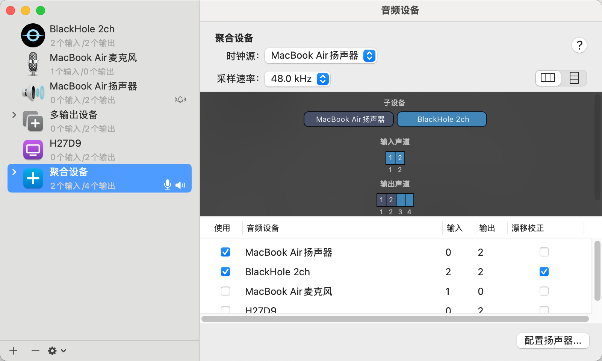
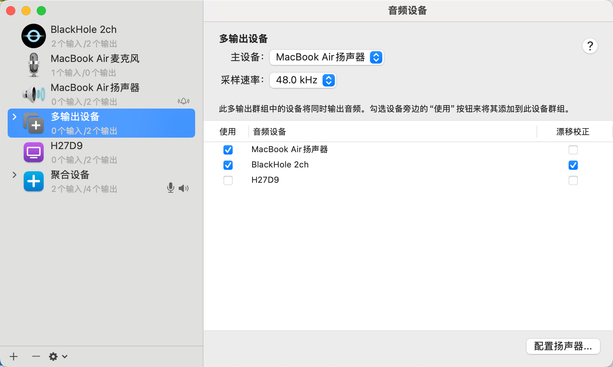
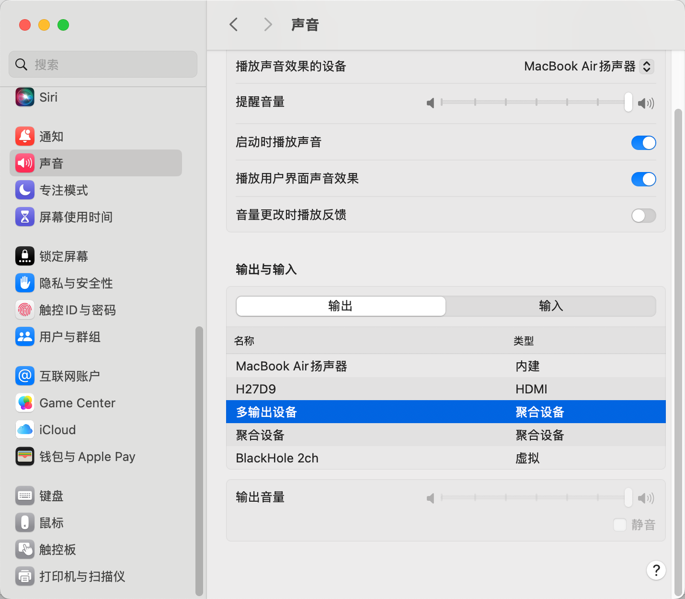

# Echo Cancellation (AEC) Configuration Guide

## Overview

Acoustic Echo Cancellation (AEC) is a critical technology in voice interaction used to eliminate echo interference caused by speaker playback. When the system plays audio, the microphone simultaneously captures the playback content, leading to degraded speech recognition accuracy.

**How AEC Works:**

- Capture the microphone input audio signal (containing user voice + echo)
- Obtain the reference signal from speaker playback
- Use algorithms to subtract the predicted echo component from the microphone signal
- Output a clean user voice signal

## Platform Support Architecture

py-xiaozhi adopts a cross-platform adaptive strategy, selecting the optimal solution based on each operating system's characteristics:

```text
                    ┌─────────────────┐
                    │   py-xiaozhi    │
                    │  AEC Processor  │
                    └─────────┬───────┘
                              │
                    ┌─────────▼───────┐
                    │  Platform Check │
                    └─┬─────┬─────┬───┘
            ┌─────────▼─┐ ┌─▼───┐ ┌▼──────────┐
            │  Windows  │ │Linux│ │   macOS   │
            │ System AEC│ │PA-AEC│ │WebRTC+BH │
            └───────────┘ └─────┘ └───────────┘
                 │           │         │
            ┌────▼────┐ ┌────▼───┐ ┌───▼────┐
            │Plug & Play│ │One-time│ │Needs  │
            │          │ │ Config │ │ Config │
            └──────────┘ └────────┘ └────────┘
```

### Windows Platform

- **Solution**: System-level driver-layer AEC
- **Advantage**: Zero configuration, plug and play
- **Principle**: Audio driver already handles echo cancellation
- **Performance**: Lowest latency, no additional overhead

### Linux Platform

- **Solution**: PulseAudio modular AEC
- **Advantage**: System-level processing, transparent to applications
- **Principle**: module-echo-cancel + WebRTC algorithm
- **Configuration**: One-time setup, persistent across sessions

### macOS Platform

- **Solution**: WebRTC + BlackHole virtual device
- **Advantage**: Real-time processing, controllable results
- **Principle**: Application-layer real-time algorithm processing
- **Configuration**: Requires installing a virtual audio device

---

# Linux Platform Configuration

## System Requirements

| Item | Requirement |
|------|-------------|
| **Operating System** | PulseAudio-based Linux distribution |
| **Tested Environments** | Ubuntu 20.04+ / Fedora 35+ |
| **Recommended Hardware** | External USB microphone + standalone speakers |

> **Hardware Advice**: Laptop built-in microphone + speaker combinations have limited AEC effectiveness due to physical vibration coupling.

## Technical Architecture

```text
┌─────────────┐    ┌─────────────────┐    ┌──────────────┐
│ Physical Mic│───▶│  module-echo-   │───▶│ Virtual Dev  │
│            │    │  cancel        │    │ echoCancel_  │
└─────────────┘    └─────────────────┘    │ source       │
                           ▲               └──────┬───────┘
┌─────────────┐           │                      │
│ Speaker Out │───────────┘                      ▼
└─────────────┘                          ┌──────────────┐
                                         │ py-xiaozhi   │
                                         │ Audio Input  │
                                         └──────────────┘
```

## One-Click Configuration Script

### Download and Install

```bash
# Download configuration script
git clone https://github.com/W-E-A/PulseAudio-AEC-Script.git
cd PulseAudio-AEC-Script

# Set execution permissions
chmod +x setup_aec.sh uninstall_aec.sh
```

### Run Configuration

```bash
# Run the installation script (do NOT use sudo)
./setup_aec.sh
```

**Configuration process:**

1. **Device Detection** - Script scans all available microphone devices
2. **Device Selection** - Select the target microphone (recommended: USB external mic)
3. **Module Configuration** - Automatically configure PulseAudio echo cancellation module
4. **Service Restart** - Restart audio service to apply configuration

### System Settings

After configuration:

1. Open system "Sound" settings
2. **Input Device**: Select the virtual microphone containing `echo cancellation`
3. **Output Device**: Select the virtual speaker containing `echo cancellation`

### Effect Verification


### Uninstall Configuration

```bash
# Restore original configuration
./uninstall_aec.sh
```

## Troubleshooting

### Common Issues

**Q1: No echo cancellation device found after running the script**

Solution:

```bash
# Check PulseAudio status
pactl list sources short
pactl list sinks short

# Restart audio service
pulseaudio -k
```

**Q2: Built-in microphone AEC ineffective**

Root Cause Analysis:

- Physical vibration coupling: Speaker vibration transmitted to built-in microphone
- Device compatibility: Some built-in devices don't support the AEC module

Suggested Solutions:

- Use external USB microphone + standalone speakers
- Physically isolate vibration sources

**Q3: Increased audio latency after configuration**

Tuning:

```bash
# Check buffer settings
pactl list sources | grep -A10 "echo-cancel"

# Adjust latency parameters (optional)
# Edit ~/.config/pulse/default.pa
# Add: load-module module-echo-cancel aec_args='"frame_size_ms=8"'
```

---

# macOS Platform Configuration

## System Requirements

| Item | Requirement |
|------|-------------|
| **Operating System** | macOS 10.15+ |
| **Virtual Audio** | BlackHole 2ch |
| **Python Dependency** | webrtc-audio-processing |

## Technical Architecture

```text
┌─────────────┐    ┌─────────────────┐    ┌──────────────┐
│ Physical Mic│───▶│  WebRTC AEC     │───▶│ py-xiaozhi   │
│            │    │  Real-time Proc │    │ Audio Input  │
└─────────────┘    └─────────┬───────┘    └──────────────┘
                             ▲
              ┌──────────────▼───────────────┐
              │    Aggregate Device /        │
              │    Multi-Output Device       │
              └──┬─────────────────────┬─────┘
┌─────────────▼─┐                    ┌▼──────────────┐
│ Physical      │                    │ BlackHole 2ch │
│ Speakers      │                    │ (Ref Signal)  │
│ (User Audio)  │                    │               │
└───────────────┘                    └───────────────┘
```

## Install BlackHole

### Method 1: Homebrew Installation (Recommended)

```bash
# Install BlackHole
brew install blackhole-2ch
```

### Method 2: Manual Installation

1. Visit the [BlackHole Official Page](https://github.com/ExistentialAudio/BlackHole)
2. Download the BlackHole 2ch installer package
3. Run the installer and authorize

## Audio Device Configuration

### Step 1: Create Aggregate Device

> If this doesn't work, create a Multi-Output Device instead and check both the speakers and BlackHole. Documentation and AI both recommend creating an aggregate device, but in actual testing, creating a Multi-Output Device is necessary for WebRTC echo cancellation to work correctly.

1. Open "Applications" → "Utilities" → "Audio MIDI Setup"
2. Click the "+" button in the bottom left → "Create Aggregate Device"
3. Configure the aggregate device:
   - MacBook Air Speakers (primary device)
   - BlackHole 2ch
   - Sample rate: 48.0 kHz




> **Configuration Note**: The aggregate device ensures synchronized audio output to both the speakers and BlackHole, providing precise time alignment for AEC.

### Step 2: System Audio Settings

1. Open "System Preferences" → "Sound"
2. **Output**: Select the aggregate device you just created
3. **Input**: Keep the default microphone device



> **Volume Control Limitation**: Aggregate devices cannot directly adjust system volume. You can adjust individual sub-device volumes in Audio MIDI Setup.

### Step 3: Verify Device Availability

```bash
# Check if BlackHole device is recognized
python3 -c "
import sounddevice as sd
devices = sd.query_devices()
for i, device in enumerate(devices):
    if 'blackhole' in device['name'].lower():
        print(f'[{i}] {device[\"name\"]} - {device[\"max_input_channels\"]}ch input')
"
```

## Application Auto-Configuration

py-xiaozhi automatically executes the following at startup:

1. **Device Detection** - Scan and identify BlackHole 2ch device
2. **AEC Initialization** - Create WebRTC audio processing instance
3. **Reference Signal Stream** - Establish BlackHole audio capture stream
4. **Real-Time Processing** - Start echo cancellation processing for microphone audio

### Configuration Verification

```python
# Check AEC status
from src.audio_codecs.audio_codec import AudioCodec

codec = AudioCodec()
await codec.initialize()

# Get AEC status
status = codec.get_aec_status()
print(f"AEC Enabled: {status['enabled']}")
print(f"Reference Signal Available: {status['reference_available']}")
```

## Troubleshooting

### Common Issues

#### Q1: BlackHole device not found

Solution:

```bash
# Reinstall BlackHole
brew reinstall blackhole-2ch

# Restart CoreAudio service
sudo launchctl kickstart -kp system/com.apple.audio.coreaudiod
```

#### Q2: Unable to create aggregate device

Checklist:

- Confirm BlackHole is properly installed
- Restart the "Audio MIDI Setup" application
- Check system audio permission settings

#### Q3: AEC ineffective

Optimization Suggestions:

- Ensure you are using an aggregate device, not a multi-output device
- Adjust the physical distance between microphone and speakers
- Check environmental noise levels

#### Q4: High audio latency

Tuning:

- Reduce audio buffer size
- Use wired audio devices instead of Bluetooth
- Close other audio processing software

---

# Configuration Verification and Testing

## Status Check

### General Status Verification

```python
# Check AEC status after launching py-xiaozhi
from src.audio_codecs.audio_codec import AudioCodec

codec = AudioCodec()
await codec.initialize()

# Get detailed status information
status = codec.get_aec_status()
print(f"AEC Enabled: {status['enabled']}")
print(f"Platform Type: {status.get('aec_type', 'unknown')}")
print(f"Description: {status.get('description', 'N/A')}")
```

### Platform-Specific Checks

#### Windows

```bash
# Check audio driver AEC support
# View audio device properties in Device Manager
```

#### Linux

```bash
# Verify PulseAudio AEC module
pactl list sources | grep -i "echo"
pactl list sinks | grep -i "echo"

# Check module load status
pactl list modules | grep echo-cancel
```

#### macOS

```bash
# Verify BlackHole device
system_profiler SPAudioDataType | grep -i blackhole

# Check aggregate device
# Confirm device status in Audio MIDI Setup
```

## Functional Testing

- In theory, after enabling AEC in config.json, selecting auto conversation mode should work normally if the system no longer talks to itself. Linux and macOS require configuration, while Windows has been tested by several people and works normally as the system driver layer already handles it.

## Reference Resources

### Official Documentation

- [PulseAudio AEC Script](https://github.com/W-E-A/PulseAudio-AEC-Script) - Linux auto-configuration script
- [BlackHole Official Repository](https://github.com/ExistentialAudio/BlackHole) - macOS virtual audio device
- [WebRTC Audio Processing](https://webrtc.googlesource.com/src/+/refs/heads/master/modules/audio_processing/) - Algorithm implementation documentation
