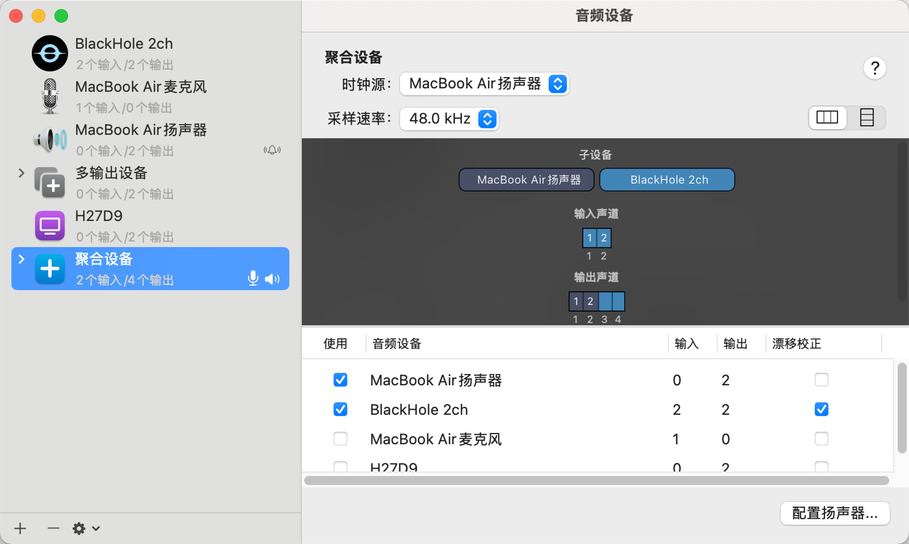
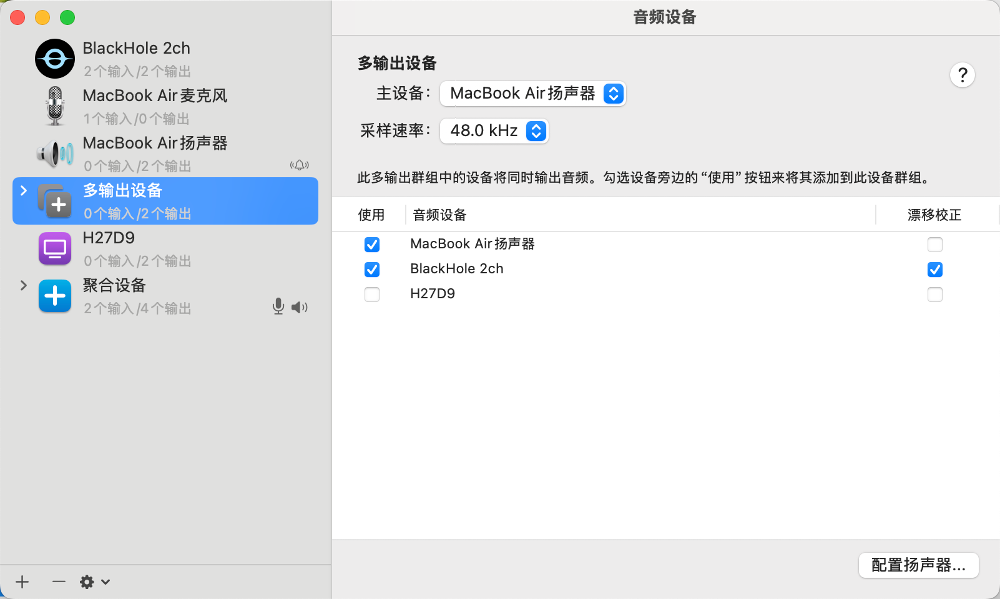

# Echo Cancellation (AEC) Configuration Guide

## Overview

Acoustic Echo Cancellation (AEC) is a critical technology in voice interaction used to eliminate echo interference caused by speaker playback. When the system plays audio, the microphone simultaneously captures the playback content, leading to degraded speech recognition accuracy or even "self-talk" (the AI hears and responds to its own voice).

**How AEC Works:**

- Capture the microphone input audio signal (containing user voice + echo)
- Obtain the reference signal from speaker playback
- Use algorithms to subtract the predicted echo component from the microphone signal
- Output a clean user voice signal

## Built-in AEC (Default, Works Out of the Box on All Platforms)

py-xiaozhi ships with WebRTC APM (`libs/webrtc_apm`, with native libraries for Windows/macOS/Linux). It uses **this app's own TTS/music mix** as the reference signal (self far) and performs echo cancellation inside the app — **no system configuration required**.

```text
┌──────────────┐                        ┌──────────────┐
│ Microphone   │──── near (w/ echo) ───▶│              │
└──────────────┘                        │  WebRTC APM  │──▶ clean voice ──▶ ASR/upstream
┌──────────────┐                        │  (in-app)    │
│ TTS/music mix│──── far reference ────▶│              │
└──────┬───────┘                        └──────────────┘
       └────────▶ speaker playback
```

### How to Enable

Edit the config file, or toggle it in the GUI settings page:

```json
{
  "AEC_OPTIONS": {
    "ENABLED": true,
    "MUSIC_PARALLEL": true,
    "FRAME_DELAY": 3,
    "ENABLE_PREPROCESS": true
  }
}
```

| Option              | Description                                                  |
| ------------------- | ------------------------------------------------------------ |
| `ENABLED`           | When enabled, enters real-time conversation mode (REALTIME) — you can interrupt the AI anytime |
| `MUSIC_PARALLEL`    | With AEC active, TTS and music play in parallel (music auto-ducked); falls back to pausing music when AEC is bypassed |
| `FRAME_DELAY`       | Delay compensation frames; actual compensation = 40ms + N × protocol frame duration |
| `ENABLE_PREPROCESS` | Noise suppression / high-pass preprocessing                  |

See [Configuration Guide](./配置说明.md) for the full option reference.

### Behavior Notes

- **Auto bypass**: If the AEC engine fails to initialize, it bypasses automatically without affecting audio I/O; while bypassed, music parallel playback falls back to "pause music during TTS"
- **Device hot-swap**: The engine is rebuilt automatically after switching input/output devices — no restart needed
- **Mode linkage**: `ENABLED: true` defaults to real-time conversation (REALTIME); `false` defaults to turn-based conversation (AUTO_STOP)

### Verifying the Effect

```text
1. Enable AEC, start the app, and choose auto conversation
2. Have the AI play music or a long TTS sentence, then speak over it to interrupt
3. Expected: no self-talk, interruption works, recognition stays clean while music and TTS play in parallel
```

You can also check the engine state in code:

```python
# Whether the AEC engine is present and working
codec.aec_active  # True = active, False = disabled or bypassed
```

### Limitations

Built-in AEC only uses **this app's playback** as the reference signal, therefore:

- ✅ Cancels: TTS and music played by py-xiaozhi itself
- ❌ Cannot cancel: audio from other applications (browser videos, other players, etc.)

To cancel audio from other applications, use the system-level options below as an enhancement.

---

## System-Level AEC (Optional Enhancement)

System-level solutions perform echo cancellation at the OS layer, with the reference signal covering **all system output**, so they can cancel audio from other applications. They require some setup — use as needed.

### 🪟 Windows

- **Solution**: Audio driver-level AEC (works out of the box on most devices)
- **Note**: Many sound card / headset drivers ship with built-in echo cancellation

### 🐧 Linux (PulseAudio)

Use the `module-echo-cancel` module for system-level echo cancellation:

```bash
# One-click configuration script
git clone https://github.com/W-E-A/PulseAudio-AEC-Script.git
cd PulseAudio-AEC-Script
chmod +x setup_aec.sh uninstall_aec.sh

# Run the installation script (do NOT use sudo)
./setup_aec.sh
```

After configuration, in the system "Sound" settings:

1. **Input device**: select the virtual microphone containing `echo cancellation`
2. **Output device**: select the virtual speaker containing `echo cancellation`

> ⚠️ **Hardware Recommendation**: Built-in laptop microphone + speaker combinations have limited AEC effectiveness due to physical vibration coupling; an external USB microphone + standalone speakers are recommended

Common issues:

```bash
# If no echo cancellation device is found
pactl list sources short
pactl list sinks short
pulseaudio -k   # restart the audio service

# Check module load status
pactl list modules | grep echo-cancel
```

Uninstall: `./uninstall_aec.sh`

### 🍎 macOS (BlackHole)

Use the BlackHole virtual device + an aggregate device to route system output back as the reference signal:

```bash
# Install BlackHole
brew install blackhole-2ch
```

1. Open "Audio MIDI Setup" → "+" → "Create Aggregate Device" (on some machines a **Multi-Output Device** is required instead)
   - ✅ Built-in speakers (primary device)
   - ✅ BlackHole 2ch
   - Sample rate: 48.0 kHz
2. System "Sound" settings: **Output** = the aggregate device, **Input** = your physical microphone




> ⚠️ **Volume Control Limitation**: Aggregate devices cannot adjust system volume directly; adjust each sub-device's volume in Audio MIDI Setup

Device verification:

```bash
# Verify the BlackHole device
system_profiler SPAudioDataType | grep -i blackhole

# If the device is missing, reinstall and restart CoreAudio
brew reinstall blackhole-2ch
sudo launchctl kickstart -kp system/com.apple.audio.coreaudiod
```

---

## Troubleshooting

**Q1: Still self-talking after enabling AEC**

- Confirm the logs contain no "创建 AEC 引擎失败" (AEC engine creation failed) / "AEC 未启用" (AEC not enabled) messages
- Lower the speaker volume, or increase the distance between microphone and speaker
- Increase `FRAME_DELAY` moderately (Bluetooth devices have higher latency)

**Q2: Poor results with the built-in microphone**

- Physical vibration coupling: speaker vibration transmits directly to the built-in microphone
- Recommendation: external USB microphone + standalone speakers, or headphones (physically echo-free)

**Q3: The AI hears music played by other software**

- A known limitation of built-in AEC (the reference signal only covers this app's output)
- Use the system-level options above, or pause other software during conversations

## References

- [WebRTC Audio Processing](https://webrtc.googlesource.com/src/+/refs/heads/master/modules/audio_processing/) - Algorithm implementation documentation
- [PulseAudio AEC Script](https://github.com/W-E-A/PulseAudio-AEC-Script) - Linux system-level configuration script
- [BlackHole Official Repository](https://github.com/ExistentialAudio/BlackHole) - macOS virtual audio device
