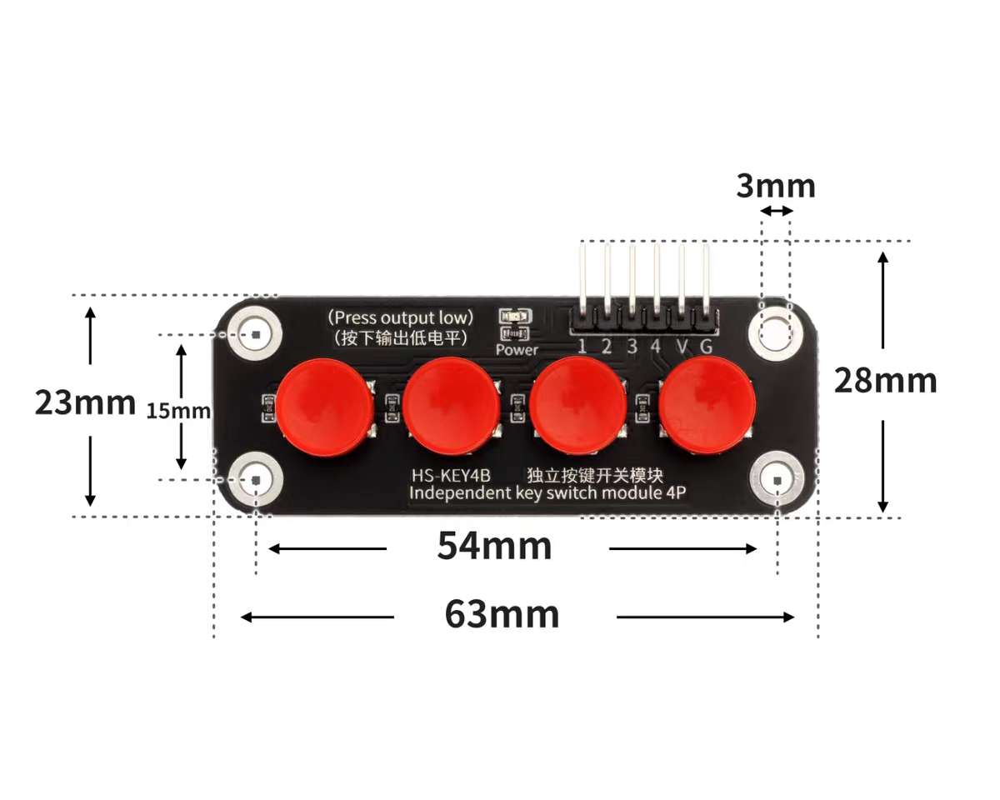
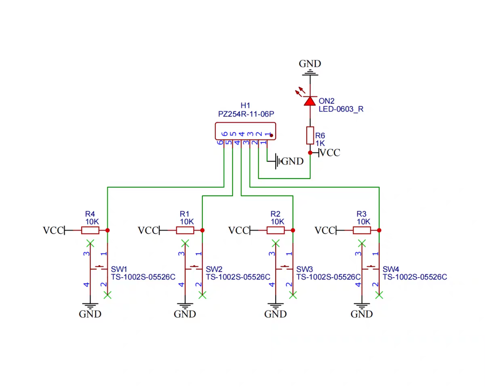
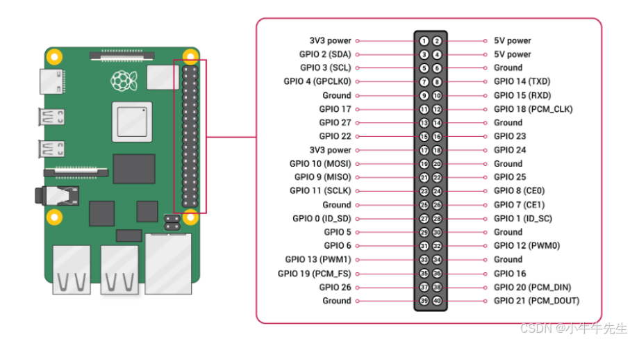
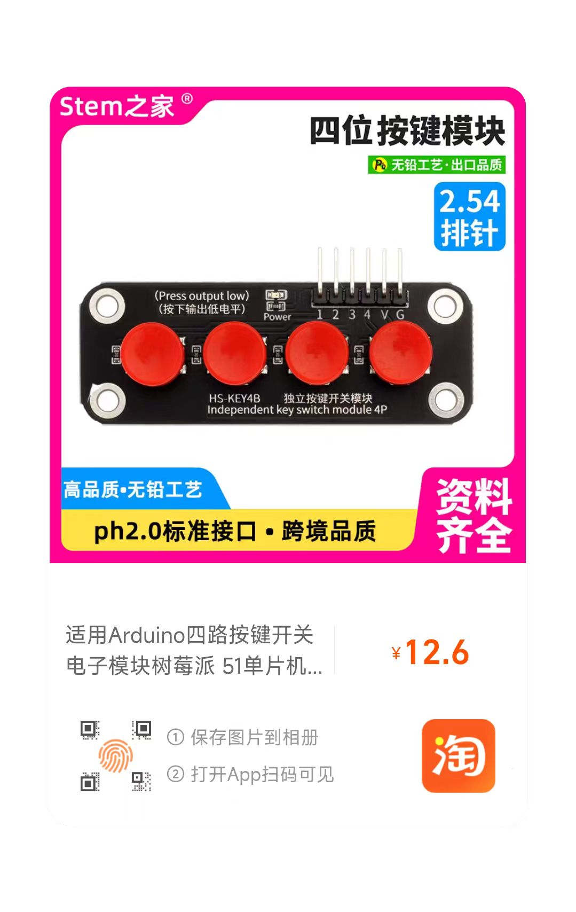

# py-xiaozhi Secondary Development Guide

> This document is intended for developers who wish to extend py-xiaozhi with new features, develop plugins, or customize the UI.

## Table of Contents

- [Project Architecture Overview](#project-architecture-overview)
- [Quick Start](#quick-start)
- [Modifying the Project Name](#modifying-the-project-name)
- [Customizing Verification Code Announcements](#customizing-verification-code-announcements)
- [Customizing GPIO Pins](#customizing-gpio-pins)
- [Plugin Development](#plugin-development)
- [MCP Tool Development](#mcp-tool-development)
- [UI Page Development](#ui-page-development)
- [Event Bus Communication](#event-bus-communication)
- [Configuration Management](#configuration-management)
- [Debugging and Testing](#debugging-and-testing)
- [Best Practices](#best-practices)

---

## Project Architecture Overview

### Directory Structure

```
py-xiaozhi/
├── main.py                 # Application entry point
├── src/
│   ├── activation/         # Device activation module
│   ├── audio_codecs/       # Audio codecs
│   ├── audio_processing/   # Audio processing (AEC, VAD, etc.)
│   ├── bootstrap/          # Service container and startup logic
│   │   ├── container.py    # ServiceContainer core
│   │   └── protocols.py    # Plugin interface protocols
│   ├── constants/          # Constant definitions
│   ├── core/               # Core modules
│   │   ├── event_bus.py    # Event bus
│   │   ├── state_manager.py# State manager
│   │   └── task_manager.py # Task manager
│   ├── logging/            # Logging system
│   ├── mcp/                # MCP tool system
│   │   ├── decorators.py   # Tool decorators
│   │   ├── mcp_server.py   # MCP server
│   │   ├── tooling.py      # Tool infrastructure
│   │   └── tools/          # Tool implementation directory
│   ├── plugins/            # Plugin system
│   │   ├── base.py         # Plugin base class
│   │   ├── manager.py      # Plugin manager
│   │   ├── audio.py        # Audio plugin
│   │   ├── ui.py           # UI plugin
│   │   ├── mcp.py          # MCP plugin
│   │   └── wake_word.py    # Wake word plugin
│   ├── protocols/          # Communication protocols
│   ├── ui/                 # UI layer
│   │   ├── cli/            # Command-line interface
│   │   ├── gui/            # Graphical interface
│   │   │   ├── manager.py  # ViewManager
│   │   │   ├── qml/        # QML files
│   │   │   └── services/   # GUI services
│   │   ├── gpio/           # GPIO button interface (Linux only)
│   │   │   ├── manager.py  # GPIOViewManager
│   │   │   └── input.py    # GPIO button input
│   │   └── shared/         # Shared components
│   │       ├── bridge.py   # EventBridge
│   │       └── models/     # Data models
│   └── utils/              # Utility classes
```

### Core Component Relationships

```
┌─────────────────────────────────────────────────────────┐
│                     ServiceContainer                     │
│  ┌─────────────┐  ┌─────────────┐  ┌─────────────────┐  │
│  │ TaskManager │  │StateManager │  │   EventBus      │  │
│  └─────────────┘  └─────────────┘  └─────────────────┘  │
│                           │                              │
│  ┌───────────────────────────────────────────────────┐  │
│  │                  PluginManager                     │  │
│  │  ┌────────┐ ┌────────┐ ┌────────┐ ┌────────────┐  │  │
│  │  │ Audio  │ │   UI   │ │  MCP   │ │  WakeWord  │  │  │
│  │  │ Plugin │ │ Plugin │ │ Plugin │ │   Plugin   │  │  │
│  │  └────────┘ └────────┘ └────────┘ └────────────┘  │  │
│  └───────────────────────────────────────────────────┘  │
└─────────────────────────────────────────────────────────┘
```

---

## Quick Start

### Environment Setup

```bash
# Clone the project
git clone https://github.com/your-repo/py-xiaozhi.git
cd py-xiaozhi

# Create a virtual environment
python -m venv venv
source venv/bin/activate  # Linux/macOS
# or venv\Scripts\activate  # Windows

# Install dependencies
pip install -r requirements.txt
```

### Running the Application

```bash
# GUI mode
python main.py --mode gui

# CLI mode
python main.py --mode cli

# Skip activation (for debugging)
python main.py --mode gui --skip-activation
```

---

## Modifying the Project Name

If you need to change the project name (e.g., for a fork), modify `APP_NAME` in `src/constants/system.py`:

```python
# src/constants/system.py
class SystemConstants:
    APP_NAME = "my-xiaozhi"  # Change to your project name
    APP_VERSION = "2.0.0"
    # ...
```

Effects of the change:
- The user data directory will change to `~/Library/Application Support/my-xiaozhi/` (macOS)
- Config files, caches, logs, etc. will all be stored under the new directory
- Data from differently named projects is isolated and will not conflict

> **Note**: After changing the project name, existing user configurations will not be automatically migrated. You will need to manually copy or reconfigure them.

---

## Customizing Verification Code Announcements

During device activation, a verification code is announced using pre-recorded audio files. Audio resources are located in the `assets/sounds/` directory.

**Supported languages (37 total)**:

```
assets/sounds/
├── zh-CN/          # Simplified Chinese (default)
├── zh-TW/          # Traditional Chinese
├── en-US/          # English
├── ja-JP/          # Japanese
├── ko-KR/          # Korean
├── de-DE/          # German
├── fr-FR/          # French
├── es-ES/          # Spanish
├── ... (more languages)
└── vi-VN/          # Vietnamese
```

**Audio files included per language**:

| File | Description |
|------|-------------|
| `0.ogg` ~ `9.ogg` | Pronunciation of digits 0-9 |
| `activation.ogg` | Activation prompt (e.g., "Please enter the verification code") |

**Changing the announcement language**:

Modify the `locale` parameter in `src/activation/service.py`:

```python
from src.utils.activation_announcer import announce_activation_code

# Use English
announce_activation_code(code, locale="en-US")

# Use Japanese
announce_activation_code(code, locale="ja-JP")
```

**Replacing audio files**:

1. Prepare new OGG-format audio files (recommended sample rate: 24kHz)
2. Replace the files in the corresponding language directory
3. File names must remain consistent (`0.ogg` ~ `9.ogg`, `activation.ogg`)

**Adding a new language**:

1. Create a new language directory under `assets/sounds/` (e.g., `my-lang/`)
2. Add the 11 required OGG audio files
3. Specify the new locale when calling: `announce_activation_code(code, locale="my-lang")`

---

## Customizing GPIO Pins

GPIO mode is only supported on Linux systems (Raspberry Pi) and is used to control the device via physical buttons.

**Recommended hardware: Four-button independent button module**





**Hardware wiring instructions**

Button module 6-pin (1 2 3 4 V G) to Raspberry Pi 5:



**Power wiring:**

| Module Pin | Raspberry Pi Pin | Description |
|------------|------------------|-------------|
| V | 3.3V (Pin 1 or Pin 17) | Positive power |
| G | GND (Pin 6/9/14/20/25/30/34/39) | Negative power, recommended Pin 6 |

> Warning: Do not connect to 5V (Pin 2/4), as this will damage the module!

**Button wiring:**

| Module Pin | GPIO (BCM) | Physical Pin | Function |
|------------|-------------|--------------|----------|
| 1 | GPIO 17 | Pin 11 | Start/stop conversation |
| 2 | GPIO 27 | Pin 13 | Interrupt current speech |
| 3 | GPIO 22 | Pin 15 | Toggle manual/auto mode |
| 4 | GPIO 23 | Pin 16 | Exit program |

> Module behavior: outputs low level when pressed; code uses BCM numbering: 17/27/22/23

**Modifying pin configuration**:

Edit `DEFAULT_PINS` in `src/ui/gpio/input.py`:

```python
# src/ui/gpio/input.py

# Default GPIO pin configuration (BCM numbering)
# In order: KEY1, KEY2, KEY3, KEY4
DEFAULT_PINS: List[int] = [17, 27, 22, 23]

# Change to match your actual wiring, for example:
# DEFAULT_PINS: List[int] = [5, 6, 13, 19]
```

**Dependency installation**:

```bash
# Install the gpiozero library
sudo apt install python3-gpiozero python3-rpi.gpio

# Optional: if your system has this package, install it too (gpiozero prefers it)
sudo apt install -y python3-lgpio || true

# Add current user to the gpio group (avoids needing sudo each time)
sudo usermod -aG gpio $USER
# Log out and log back in or reboot for it to take effect
```

**Running GPIO mode**:

```bash
python main.py --mode gpio --protocol websocket
```

**Purchasing the button module**:




## Plugin Development

Plugins are the core way to extend py-xiaozhi's functionality. By inheriting from the `Plugin` base class, you can:
- Respond to system events (audio data, JSON messages, state changes, etc.)
- Invoke core commands (send audio, start listening, etc.)
- Interact with other plugins

### Creating a Plugin

Create a new file in the `src/plugins/` directory:

```python
# src/plugins/my_plugin.py

from typing import Any, TYPE_CHECKING
from src.plugins.base import Plugin
from src.logging import get_logger

if TYPE_CHECKING:
    from src.bootstrap.protocols import PluginCommands, PluginContext

logger = get_logger()


class MyPlugin(Plugin):
    """My custom plugin"""

    # Unique plugin identifier (required)
    name = "my_plugin"

    # Priority: 1-100, lower numbers initialize first
    priority = 50

    # Dependent plugins (optional)
    requires = ["audio"]  # Declare dependency on AudioPlugin

    def __init__(self):
        super().__init__()
        self._my_state = None

    async def setup(self, ctx: "PluginContext", cmd: "PluginCommands") -> None:
        """Plugin initialization phase

        Args:
            ctx: Plugin context, used for reading state (read-only)
            cmd: Plugin command interface, used for executing operations
        """
        await super().setup(ctx, cmd)

        # Access context via self.ctx
        config = self.ctx.get_config()

        # Access dependent plugins via self.deps
        audio_plugin = self.deps.get("audio")

        logger.info("MyPlugin initialized")

    async def start(self) -> None:
        """Plugin start (called after protocol connection is established)"""
        await super().start()

        # Subscribe to events
        from src.core.event_bus import Events
        self.ctx.event_bus.on(Events.DEVICE_STATE_CHANGED, self._on_state_changed)

        logger.info("MyPlugin started")

    async def on_protocol_connected(self, protocol: Any) -> None:
        """Notification when protocol channel is established"""
        logger.info("Protocol connected")

    async def on_incoming_json(self, message: Any) -> None:
        """Notification when a JSON message is received

        Args:
            message: JSON message dictionary
        """
        if not isinstance(message, dict):
            return

        msg_type = message.get("type")
        if msg_type == "my_custom_type":
            # Handle custom message
            pass

    async def on_incoming_audio(self, data: bytes) -> None:
        """Notification when audio data is received

        Args:
            data: Raw audio byte data
        """
        # Process audio data
        pass

    async def on_device_state_changed(self, state: Any) -> None:
        """Device state change notification"""
        from src.constants.constants import DeviceState

        if state == DeviceState.LISTENING:
            logger.info("Device is listening")
        elif state == DeviceState.SPEAKING:
            logger.info("Device is speaking")

    async def _on_state_changed(self, state):
        """EventBus event handler"""
        logger.debug(f"State changed: {state}")

    async def stop(self) -> None:
        """Plugin stop"""
        await super().stop()
        logger.info("MyPlugin stopped")

    async def shutdown(self) -> None:
        """Plugin final cleanup"""
        # Unsubscribe from events
        from src.core.event_bus import Events
        self.ctx.event_bus.off(Events.DEVICE_STATE_CHANGED, self._on_state_changed)

        await super().shutdown()
        logger.info("MyPlugin cleaned up")
```

### Registering a Plugin

Register the plugin in `src/bootstrap/container.py`:

```python
from src.plugins.my_plugin import MyPlugin

# In the _setup_plugins method, add:
self.plugins.register(
    AudioPlugin(),
    UIPlugin(mode=mode),
    McpPlugin(),
    WakeWordPlugin(),
    MyPlugin(),  # Add your plugin
)
```

### PluginContext Interface

`PluginContext` provides read-only state access:

| Method | Description |
|--------|-------------|
| `get_device_state()` | Get current device state |
| `get_listening_mode()` | Get current listening mode |
| `is_listening()` | Whether currently listening |
| `is_speaking()` | Whether currently speaking |
| `is_idle()` | Whether idle |
| `is_audio_channel_opened()` | Whether audio channel is open |
| `should_capture_audio()` | Whether audio should be captured |
| `get_config()` | Get configuration manager |
| `event_bus` | Get event bus |

### PluginCommands Interface

`PluginCommands` provides operation execution:

| Method | Description |
|--------|-------------|
| `start_listening(mode)` | Start listening |
| `stop_listening()` | Stop listening |
| `abort_speaking(reason)` | Abort speaking |
| `send_audio(data)` | Send audio data |
| `send_text(text)` | Send text |
| `send_wake_word_detected(text)` | Send wake word detection |
| `send_mcp_message(payload)` | Send MCP message |
| `connect_protocol()` | Connect protocol |
| `spawn(coro, name)` | Spawn async task |
| `request_shutdown()` | Request application shutdown |

---

## MCP Tool Development

MCP (Model Context Protocol) is a tool protocol for interacting with AI models. By defining MCP tools, AI can invoke your functionality.

### Creating MCP Tools

**Method 1: Using decorators (recommended)**

Create tools in the `src/mcp/tools/` directory:

```python
# src/mcp/tools/my_tools/_tools.py

from typing import Any, Dict
from src.mcp.decorators import Prop, PropType, mcp_tool
from src.logging import get_logger

logger = get_logger()


@mcp_tool(
    name="my_tools.greet",
    description=(
        "Greet the user."
        "Call this tool when the user says 'hello', 'Hi', or 'say hello'."
    ),
    props=[
        Prop("name", PropType.STR),  # Required string parameter
    ],
)
async def tool_greet(args: Dict[str, Any]) -> str:
    """Greeting tool implementation"""
    name = args.get("name", "friend")
    return f"Hello, {name}! Nice to meet you!"


@mcp_tool(
    name="my_tools.calculate",
    description=(
        "Perform simple mathematical calculations."
        "Supports addition, subtraction, multiplication, and division of two numbers."
    ),
    props=[
        Prop("num1", PropType.INT),
        Prop("num2", PropType.INT),
        Prop("operation", PropType.STR),  # add, subtract, multiply, divide
    ],
)
async def tool_calculate(args: Dict[str, Any]) -> str:
    """Calculation tool implementation"""
    num1 = args.get("num1", 0)
    num2 = args.get("num2", 0)
    operation = args.get("operation", "add")

    operations = {
        "add": num1 + num2,
        "subtract": num1 - num2,
        "multiply": num1 * num2,
        "divide": num1 / num2 if num2 != 0 else "Division by zero is not allowed",
    }

    result = operations.get(operation, "Unknown operation")
    return f"Result: {num1} {operation} {num2} = {result}"


@mcp_tool(
    name="my_tools.set_reminder",
    description=(
        "Set a reminder."
        "Use when the user says 'remind me...', 'set a reminder...', etc."
    ),
    props=[
        Prop("message", PropType.STR),
        Prop("minutes", PropType.INT, min_val=1, max_val=1440),  # With range limits
        Prop("repeat", PropType.BOOL, default=False),  # With default value
    ],
)
async def tool_set_reminder(args: Dict[str, Any]) -> str:
    """Reminder tool"""
    message = args.get("message", "")
    minutes = args.get("minutes", 5)
    repeat = args.get("repeat", False)

    # Implement reminder logic...

    repeat_text = " (daily repeat)" if repeat else ""
    return f"Reminder set: remind you '{message}' in {minutes} minute(s){repeat_text}"
```

**Directory structure requirements:**

```
src/mcp/tools/
├── __init__.py
├── my_tools/
│   ├── __init__.py      # Required, can be empty
│   └── _tools.py        # Tool definition file (auto-discovered)
```

**Method 2: Manual registration**

```python
from src.mcp.tooling import McpTool, Property, PropertyList, PropertyType

# Create property list
props = PropertyList([
    Property("param1", PropertyType.STRING),
    Property("param2", PropertyType.INTEGER, min_value=0, max_value=100),
])

# Create tool
tool = McpTool(
    name="my_tool",
    description="My tool description",
    properties=props,
    callback=my_callback_function,
)

# Manually add to MCP server
mcp_server = McpServer.get_instance()
mcp_server.add_tool(tool)
```

### Property Types

| PropType | Description | Parameters |
|----------|-------------|------------|
| `PropType.STR` | String | `name: str` |
| `PropType.INT` | Integer | `min_val`, `max_val` |
| `PropType.BOOL` | Boolean | `default: bool` |

### Tool Description Best Practices

The tool `description` is very important — the AI uses it to decide when to call the tool:

```python
@mcp_tool(
    name="music_player.play",
    description=(
        "Play the specified music."                           # Brief description
        "Call when the user says 'play...', 'play a song...'." # Trigger scenarios
        "If music is already playing, stop the current track first." # Behavior notes
        "Note: do not proactively call while TTS is speaking." # Cautions
    ),
    ...
)
```

---

## UI Page Development

py-xiaozhi's GUI uses the **PySide6 + QML (QtQuick)** architecture, following the MVVM pattern.

### Architecture Overview

```
┌─────────────────────────────────────────────────────────┐
│                       QML (View)                         │
│  ┌─────────────┐  ┌─────────────┐  ┌─────────────────┐  │
│  │ MainWindow  │  │Settings    │  │ MyWindow        │  │
│  │    .qml     │  │ Window.qml │  │    .qml         │  │
│  └──────┬──────┘  └──────┬──────┘  └────────┬────────┘  │
│         │                │                   │           │
│         ▼                ▼                   ▼           │
│  ┌───────────────────────────────────────────────────┐  │
│  │               EventBridge (Signal/Slot)            │  │
│  └───────────────────────────────────────────────────┘  │
└─────────────────────────────────────────────────────────┘
                           │
                           ▼
┌─────────────────────────────────────────────────────────┐
│                    Python (ViewModel)                    │
│  ┌─────────────┐  ┌─────────────┐  ┌─────────────────┐  │
│  │ MainModel   │  │ Settings   │  │ MyModel          │  │
│  │             │  │ Model      │  │                  │  │
│  └─────────────┘  └─────────────┘  └─────────────────┘  │
└─────────────────────────────────────────────────────────┘
```

### Creating a New Page

#### 1. Create a QML File

```qml
// src/ui/gui/qml/windows/MyWindow.qml

import QtQuick
import QtQuick.Controls
import QtQuick.Layouts
import "../theme"
import "../components"

AppWindow {
    id: root

    width: 400
    height: 300
    minimumWidth: 300
    minimumHeight: 200
    title: "My Window"

    Rectangle {
        id: content
        anchors.fill: parent
        anchors.margins: root.isMaximized ? 0 : 1
        color: Theme.background

        ColumnLayout {
            anchors.fill: parent
            anchors.margins: Theme.spacingMd
            spacing: Theme.spacingMd

            // Title
            Text {
                text: "Welcome"
                font.pixelSize: Theme.fontSizeLg
                font.weight: Font.Bold
                color: Theme.textPrimary
            }

            // Dynamic data binding
            Text {
                text: myModel ? myModel.message : "Loading..."
                font.pixelSize: Theme.fontSizeMd
                color: Theme.textSecondary
                wrapMode: Text.WordWrap
                Layout.fillWidth: true
            }

            // Input field
            Rectangle {
                Layout.fillWidth: true
                Layout.preferredHeight: 40
                color: Theme.background
                radius: Theme.radiusMd
                border.color: inputField.activeFocus ? Theme.primary : Theme.border
                border.width: 1

                TextInput {
                    id: inputField
                    anchors.fill: parent
                    anchors.margins: 10
                    font.pixelSize: Theme.fontSizeMd
                    color: Theme.textPrimary
                    verticalAlignment: TextInput.AlignVCenter

                    // Placeholder
                    Text {
                        anchors.fill: parent
                        text: "Please enter content..."
                        font: parent.font
                        color: Theme.textPlaceholder
                        verticalAlignment: Text.AlignVCenter
                        visible: !parent.text && !parent.activeFocus
                    }
                }
            }

            // Button
            Button {
                id: actionBtn
                Layout.preferredWidth: 120
                Layout.preferredHeight: 40
                text: "Confirm"

                background: Rectangle {
                    color: actionBtn.pressed
                        ? Theme.primaryPressed
                        : (actionBtn.hovered ? Theme.primaryHover : Theme.primary)
                    radius: Theme.radiusMd
                }

                contentItem: Text {
                    text: actionBtn.text
                    font.pixelSize: Theme.fontSizeMd
                    color: "white"
                    horizontalAlignment: Text.AlignHCenter
                    verticalAlignment: Text.AlignVCenter
                }

                onClicked: {
                    if (eventBridge) {
                        eventBridge.onMyAction(inputField.text)
                    }
                }
            }

            // Fill remaining space
            Item { Layout.fillHeight: true }
        }
    }
}
```

#### 2. Create Python Model

```python
# src/ui/shared/models/my_model.py

from PySide6.QtCore import QObject, Property, Signal, Slot


class MyModel(QObject):
    """My window data model"""

    # Signal definitions
    messageChanged = Signal()
    dataListChanged = Signal()

    def __init__(self, parent=None):
        super().__init__(parent)
        self._message = "Hello World"
        self._data_list = []

    # ========== message property ==========
    def get_message(self) -> str:
        return self._message

    def set_message(self, value: str) -> None:
        if self._message != value:
            self._message = value
            self.messageChanged.emit()

    message = Property(str, get_message, set_message, notify=messageChanged)

    # ========== dataList property ==========
    def get_data_list(self) -> list:
        return self._data_list

    def set_data_list(self, value: list) -> None:
        self._data_list = value
        self.dataListChanged.emit()

    dataList = Property(list, get_data_list, set_data_list, notify=dataListChanged)

    # ========== Slot methods (callable from QML) ==========
    @Slot(str, result=bool)
    def validate_input(self, text: str) -> bool:
        """Validate input"""
        return len(text) > 0

    @Slot()
    def refresh(self) -> None:
        """Refresh data"""
        # Implement refresh logic
        pass
```

#### 3. Extend EventBridge

```python
# Add to src/ui/shared/bridge.py

class EventBridge(QObject):
    # ... existing code ...

    # Add new signals
    myActionRequested = Signal(str)

    @Slot(str)
    def onMyAction(self, data: str) -> None:
        """Handle my action"""
        asyncio.create_task(
            self._event_bus.emit(Events.MY_CUSTOM_ACTION, {"data": data})
        )
```

#### 4. Register in ViewManager

```python
# src/ui/gui/manager.py

from src.ui.shared.models.my_model import MyModel

class ViewManager(QObject):
    def __init__(self, event_bus: EventBus):
        # ... existing code ...
        self._my_model = MyModel()

    def _inject_context(self):
        ctx = self._engine.rootContext()
        # ... existing code ...
        ctx.setContextProperty("myModel", self._my_model)

    @property
    def my_model(self) -> MyModel:
        return self._my_model
```

### Theme Variables

Use the `Theme` object in QML to access theme variables:

#### Colors

| Variable | Description |
|----------|-------------|
| **Primary Colors** | |
| `Theme.primary` | Primary color `#165DFF` |
| `Theme.primaryHover` | Primary hover `#4080FF` |
| `Theme.primaryPressed` | Primary pressed `#0E42D2` |
| `Theme.primaryLight` | Light blue background `#E8F3FF` |
| `Theme.primaryText` | Blue text `#2196F3` |
| **Functional Colors** | |
| `Theme.success` | Success `#00B42A` |
| `Theme.successLight` | Success light background `#E8FFEA` |
| `Theme.successBorder` | Success border `#B7EB8F` |
| `Theme.warning` | Warning `#FF7D00` |
| `Theme.warningLight` | Warning light background `#FFF7E8` |
| `Theme.warningBorder` | Warning border `#FFE58F` |
| `Theme.error` | Error `#F53F3F` |
| `Theme.errorHover` | Error hover `#FF7875` |
| `Theme.errorLight` | Error light background `#FFF2F0` |
| `Theme.errorBorder` | Error border `#FFCCC7` |
| **Background Colors** | |
| `Theme.background` | Background `#FFFFFF` |
| `Theme.backgroundSecondary` | Secondary background `#F7F8FA` |
| `Theme.backgroundHover` | Hover background `#F2F3F5` |
| **Text Colors** | |
| `Theme.textPrimary` | Primary text `#1D2129` |
| `Theme.textSecondary` | Secondary text `#4E5969` |
| `Theme.textPlaceholder` | Placeholder text `#86909C` |
| **Borders and Dividers** | |
| `Theme.border` | Border color `#E5E6EB` |
| `Theme.divider` | Divider color `#F2F3F5` |

#### Shadows

| Variable | Description |
|----------|-------------|
| `Theme.shadowColor` | Primary shadow `#15000000` |
| `Theme.shadowLight` | Light shadow `#08000000` |
| `Theme.shadowMedium` | Medium shadow `#06000000` |
| `Theme.shadowSubtle` | Subtle shadow `#04000000` |

#### Fonts

| Variable | Description |
|----------|-------------|
| `Theme.fontSizeXs` | Extra small (10px) |
| `Theme.fontSizeSm` | Small (12px) |
| `Theme.fontSizeMd` | Medium (14px) |
| `Theme.fontSizeLg` | Large (16px) |
| `Theme.fontSizeXl` | Extra large (20px) |
| `Theme.fontSizeXxl` | Huge (24px) |
| `Theme.fontFamily` | System font |
| `Theme.fontFamilyMono` | Monospace font |

#### Spacing

| Variable | Description |
|----------|-------------|
| `Theme.spacingXs` | Extra small (4px) |
| `Theme.spacingSm` | Small (8px) |
| `Theme.spacingMd` | Medium (12px) |
| `Theme.spacingLg` | Large (16px) |
| `Theme.spacingXl` | Extra large (20px) |
| `Theme.spacingXxl` | Huge (24px) |

#### Border Radius

| Variable | Description |
|----------|-------------|
| `Theme.radiusSm` | Small (4px) |
| `Theme.radiusMd` | Medium (8px) |
| `Theme.radiusLg` | Large (12px) |
| `Theme.radiusXl` | Extra large (16px) |

#### Animation

| Variable | Description |
|----------|-------------|
| `Theme.animationFast` | Fast (150ms) |
| `Theme.animationNormal` | Normal (200ms) |
| `Theme.animationSlow` | Slow (300ms) |

---

## Event Bus Communication

`EventBus` is the core mechanism for decoupled inter-component communication.

### Basic Usage

```python
from src.core.event_bus import Events, EventBus

# Get EventBus instance (via plugin context)
event_bus = self.ctx.event_bus

# Subscribe to events
async def my_handler(data):
    print(f"Received data: {data}")

event_bus.on(Events.DEVICE_STATE_CHANGED, my_handler)

# Emit events (execute all handlers in parallel)
await event_bus.emit(Events.DEVICE_STATE_CHANGED, new_state)

# Emit events sequentially
await event_bus.emit_sequential(Events.DEVICE_STATE_CHANGED, new_state)

# Unsubscribe
event_bus.off(Events.DEVICE_STATE_CHANGED, my_handler)

# Clear all handlers
event_bus.clear(Events.DEVICE_STATE_CHANGED)
```

### Predefined Events

```python
class Events:
    # Device state
    DEVICE_STATE_CHANGED = "device_state_changed"

    # Protocol related
    PROTOCOL_CONNECTED = "protocol_connected"
    PROTOCOL_DISCONNECTED = "protocol_disconnected"
    INCOMING_JSON = "incoming_json"
    INCOMING_AUDIO = "incoming_audio"

    # Network
    NETWORK_ERROR = "network_error"

    # Audio channel
    AUDIO_CHANNEL_OPENED = "audio_channel_opened"
    AUDIO_CHANNEL_CLOSED = "audio_channel_closed"

    # Application lifecycle
    APP_SHUTDOWN = "app_shutdown"

    # Music player
    MUSIC_STATE_CHANGED = "music_state_changed"
    MUSIC_LYRICS_UPDATE = "music_lyrics_update"
    MUSIC_PROGRESS_UPDATE = "music_progress_update"
    MUSIC_PAUSE_REQUEST = "music_pause_request"
    MUSIC_RESUME_REQUEST = "music_resume_request"

    # UI user actions (View → Plugin)
    UI_BUTTON_PRESS = "ui_button_press"
    UI_BUTTON_RELEASE = "ui_button_release"
    UI_MANUAL_TOGGLE = "ui_manual_toggle"
    UI_AUTO_TOGGLE = "ui_auto_toggle"
    UI_AUTO_START = "ui_auto_start"
    UI_ABORT_REQUEST = "ui_abort_request"
    UI_SEND_TEXT = "ui_send_text"
    UI_QUIT_REQUEST = "ui_quit_request"
    UI_OPEN_SETTINGS = "ui_open_settings"

    # UI updates (Plugin → View)
    UI_UPDATE_TEXT = "ui_update_text"
    UI_UPDATE_EMOTION = "ui_update_emotion"
    UI_UPDATE_STATUS = "ui_update_status"
    UI_TOGGLE_MODE = "ui_toggle_mode"
    UI_TOGGLE_WINDOW = "ui_toggle_window"

    # Configuration
    CONFIG_CHANGED = "config_changed"
```

### Adding Custom Events

```python
# src/core/event_bus.py

class Events:
    # ... existing events ...

    # Add custom events
    MY_CUSTOM_EVENT = "my_custom_event"
    MY_DATA_UPDATED = "my_data_updated"
```

### Event Data Classes

It is recommended to create data classes for complex event data:

```python
# src/my_module/events.py

from dataclasses import dataclass


@dataclass
class MyEventData:
    """My event data"""
    id: str
    name: str
    value: int
    timestamp: float


# Usage
await event_bus.emit(Events.MY_CUSTOM_EVENT, MyEventData(
    id="123",
    name="test",
    value=42,
    timestamp=time.time(),
))
```

---

## Configuration Management

Use `ConfigManager` to manage application configuration.

### Reading Configuration

```python
from src.utils.config_manager import ConfigManager

config = ConfigManager.get_instance()

# Read a configuration item
value = config.get_config("SECTION.KEY", default_value)

# Examples
aec_enabled = config.get_config("AEC_OPTIONS.ENABLED", True)
server_url = config.get_config("SERVER.URL", "ws://localhost:8080")
```

### Writing Configuration

```python
# Set a configuration item
config.set_config("SECTION.KEY", value)

# Save to file
config.save()
```

### Hot Reloading Configuration

When configuration changes need to notify other components:

```python
from src.core.event_bus import Events

# Emit an event after saving configuration
config.save()
await self.ctx.event_bus.emit(Events.CONFIG_CHANGED, {
    "key": "SECTION.KEY",
    "value": new_value,
})
```

---

## Debugging and Testing

### Starting in Debug Mode

```bash
# Skip activation
python main.py --mode gui --skip-activation

# CLI mode (easier to view logs)
python main.py --mode cli --skip-activation
```

### Logging System

```python
from src.logging import get_logger

logger = get_logger()

logger.debug("Debug message")
logger.info("Info message")
logger.warning("Warning message")
logger.error("Error message", exc_info=True)
```

### Unit Testing

```python
# tests/test_my_plugin.py

import pytest
from unittest.mock import AsyncMock, MagicMock

from src.plugins.my_plugin import MyPlugin


class TestMyPlugin:
    @pytest.fixture
    def plugin(self):
        return MyPlugin()

    @pytest.fixture
    def mock_ctx(self):
        ctx = MagicMock()
        ctx.event_bus = MagicMock()
        ctx.get_config.return_value = MagicMock()
        return ctx

    @pytest.fixture
    def mock_cmd(self):
        return MagicMock()

    @pytest.mark.asyncio
    async def test_setup(self, plugin, mock_ctx, mock_cmd):
        await plugin.setup(mock_ctx, mock_cmd)
        assert plugin._ctx == mock_ctx
        assert plugin._cmd == mock_cmd

    @pytest.mark.asyncio
    async def test_on_incoming_json(self, plugin, mock_ctx, mock_cmd):
        await plugin.setup(mock_ctx, mock_cmd)

        message = {"type": "test", "data": "value"}
        await plugin.on_incoming_json(message)

        # Verify logic
```

---

## Best Practices

### 1. Plugin Development

- Use `requires` to declare dependencies rather than directly importing other plugins
- Clean up resources and unsubscribe in `shutdown()`
- Use `self.cmd.spawn()` to spawn async tasks
- Do not directly reference other plugins; use EventBus for communication

### 2. MCP Tools

- Provide a clear `description` with trigger scenarios
- Return meaningful result strings
- Catch and handle exceptions; return friendly error messages
- Do not execute long-running blocking operations inside tools

### 3. UI Development

- Use Theme variables to maintain visual consistency
- Store only state in Model; handle only display in View
- Use EventBridge for QML <-> Python communication
- Do not call Python business logic directly from QML

### 4. Event Bus

- Use predefined Events constants
- Create data classes for complex data
- Unsubscribe when components are destroyed
- Do not create circular event triggers

### 5. Async Programming

- Use `async/await` for I/O operations
- Use `asyncio.gather()` for parallel execution
- Set reasonable timeouts
- Do not use synchronous blocking calls inside async functions

---

## References

- [PySide6 Official Documentation](https://doc.qt.io/qtforpython-6/)
- [QML Getting Started Guide](https://doc.qt.io/qt-6/qmlapplications.html)
- [MCP Protocol Specification](https://modelcontextprotocol.io/)
- [Python asyncio Documentation](https://docs.python.org/3/library/asyncio.html)

---

## FAQ

### Q: The plugin loading order is incorrect?

Adjust the `priority` value — lower numbers initialize first. You can also use `requires` to declare dependencies, and PluginManager will automatically perform topological sorting.

### Q: MCP tools are not being discovered?

Ensure:
1. Tool files are in the `src/mcp/tools/` directory
2. The directory contains an `__init__.py` file
3. Tool files are named `_tools.py` or are in the root directory
4. The `@mcp_tool` decorator is used

### Q: Cannot access Python objects from QML?

Ensure they are properly injected in `ViewManager._inject_context()`:
```python
ctx.setContextProperty("myModel", self._my_model)
```

### Q: Event handler is not being called?

1. Check that you subscribed correctly: `event_bus.on(Events.xxx, handler)`
2. Ensure the handler is an async function
3. Check whether you unsubscribed before destruction

---
