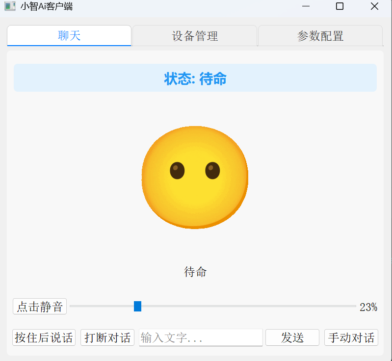

# 语音交互模式说明



## 项目概述

py-xiaozhi是一个基于Python开发的AI语音助手客户端，采用现代化的异步架构设计，支持丰富的多模态交互功能。系统集成了语音识别、自然语言处理、视觉识别、IoT设备控制等先进技术，为用户提供智能化的交互体验。

### 核心特性

- **多协议支持**: WebSocket/MQTT双协议通信
- **MCP工具生态**: 集成10+专业工具模块
- **IoT设备集成**: Thing-based架构的设备管理
- **视觉识别**: 基于GLM-4V的多模态理解
- **音频处理**: Opus编码+WebRTC增强
- **全局快捷键**: 系统级交互控制

## 语音交互模式

系统提供多种语音交互方式，支持灵活的交互控制和智能语音检测：

### 1. 手动按压模式

- **操作方法**: 按住快捷键期间录音，松开自动发送
- **默认快捷键**: `Ctrl+J` (可在配置中修改)
- **适用场景**: 精确控制录音时间，避免环境噪音干扰
- **优势特点**:
  - 避免误触发录音
  - 录音时长完全可控
  - 适合嘈杂环境使用

### 2. 回合制对话模式 (AUTO_STOP)

- **操作方法**: 按下快捷键开启/点击GUI右下角手动对话模式切换自动对话
- **默认快捷键**: `Ctrl+K` (可在配置中修改)
- **适用场景**: 安静环境、传统对话交互、AEC功能禁用时
- **工作原理**:
  - 用户说话 → AI回复 → 用户再次说话
  - 每次对话需要等待AI回复完成
  - 避免回声和双方同时说话的冲突
  - 系统在AI说话时自动禁用麦克风输入
- **技术特点**:
  - AEC禁用时的默认模式
  - 适合单向音频设备或有回声问题的环境
  - 更稳定的对话体验，避免音频冲突

### 3. 实时对话模式 (REALTIME)

- **操作方法**: 启用AEC回声消除后自动激活
- **配置要求**: `"AEC_OPTIONS.ENABLED": true`
- **适用场景**: 自然对话、双向交互、复杂环境、需要打断AI的场景
- **注意**: 需要音频设备自带aec目前自带的aec已失效

### 4. 唤醒词模式

- **操作方法**: 语音说出预设唤醒词激活系统
- **默认唤醒词**: "小智"、"小美" (可在配置中自定义)
- **模型支持**: 基于Vosk离线语音识别
- **配置要求**: 需要下载对应的语音识别模型

### 系统状态管理

系统采用事件驱动的状态机架构，具有以下运行状态：

```
┌─────────────────────────────────────────────────────────┐
│                    系统状态流转图                          │
└─────────────────────────────────────────────────────────┘

     IDLE              CONNECTING           LISTENING
  ┌─────────┐    唤醒词/按钮   ┌─────────┐  连接成功  ┌─────────┐
  │  空闲   │  ─────────────> │  连接中  │ ────────> │  聆听中  │
  │  待命   │                │  服务器  │           │  录音中  │
  └─────────┘                └─────────┘           └─────────┘
       ↑                           │                     │
       │                         连接失败                 │ 语音识别
       │                           │                     │ 完成/超时
       │                           ↓                     │
       │                     ┌─────────┐                 │
       └──── 播放完成/中断 ──── │  回复中  │ <──────────────┘
                             │  AI说话  │
                             └─────────┘
```

## 运行模式与部署

### GUI模式 (默认)

图形用户界面模式，提供直观的交互体验：

```bash
# 标准启动
python main.py

# 使用MQTT协议
python main.py --protocol mqtt
```

**GUI模式特性**:

- 可视化操作界面
- 实时状态显示
- 音频波形可视化
- 系统托盘支持
- 图形化设置界面

### CLI模式

命令行界面模式，适合服务器部署：

```bash
# CLI模式启动
python main.py --mode cli

# CLI + MQTT协议
python main.py --mode cli --protocol mqtt
```

**CLI模式特性**:

- 低资源占用
- 服务器友好
- 详细日志输出
- 键盘快捷键支持
- 脚本化部署

### GPIO模式

GPIO 按键控制模式，适合树莓派等嵌入式设备：

```bash
# GPIO模式启动（仅Linux）
python main.py --mode gpio

# GPIO + MQTT协议
python main.py --mode gpio --protocol mqtt
```

**GPIO模式特性**:

- 仅支持 Linux 系统（树莓派）
- 通过物理按键控制
- 无需屏幕和键盘
- 适合嵌入式部署

**默认按键功能**:

| 按键 | GPIO引脚 | 功能 |
|------|----------|------|
| KEY1 | GPIO 17 | 开始/停止对话 |
| KEY2 | GPIO 27 | 中断当前语音 |
| KEY3 | GPIO 22 | 切换手动/自动模式 |
| KEY4 | GPIO 23 | 退出程序 |

**构建特性**:

- 跨平台支持
- 单文件模式
- 依赖打包
- 自动化配置

## 平台兼容性

### Windows 平台

- **完全兼容**: 所有功能正常支持
- **音频增强**: 支持Windows音频API
- **音量控制**: 集成pycaw音量管理
- **系统托盘**: 完整托盘功能支持
- **全局热键**: 完整快捷键功能

### macOS 平台  

- **完全兼容**: 核心功能完整支持
- **状态栏**: 托盘图标显示在顶部状态栏
- **权限管理**: 可能需要授权麦克风/摄像头权限
- **快捷键**: 部分快捷键需要系统权限
- **音频**: 原生CoreAudio支持

### Linux 平台

- **兼容性**: 支持主流发行版(Ubuntu/CentOS/Debian)
- **桌面环境**:
  - GNOME: 完整支持
  - KDE: 完整支持  
  - Xfce: 需要额外托盘支持
- **音频系统**:
  - PulseAudio: 推荐(自动检测)
  - ALSA: 备用方案
- **依赖**: 可能需要安装系统托盘支持包

```bash
# Ubuntu/Debian 托盘支持
sudo apt-get install libappindicator3-1

# CentOS/RHEL 托盘支持  
sudo yum install libappindicator-gtk3
```

## 故障排除指南

### 常见问题

**1. 语音识别不工作**

- 使用小美、小明等简易识别的唤醒词

**2. 摄像头无法使用**

```bash
# 测试摄像头
python scripts/camera_scanner.py

# 检查摄像头权限和设备索引
```

**3. 快捷键不响应**

- 检查是否有其他程序占用相同快捷键
- 尝试以管理员权限运行(Windows)
- 检查系统安全软件拦截

**4. 网络连接问题**

- 检查防火墙设置
- 验证WebSocket/MQTT服务器地址
- 测试网络连通性
